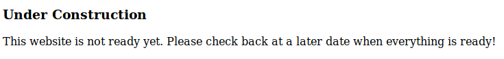
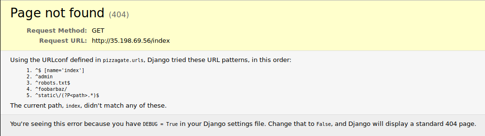
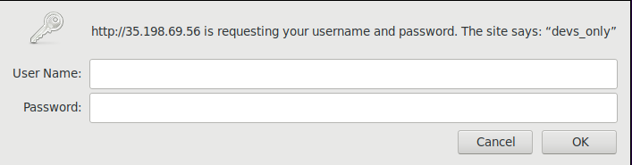
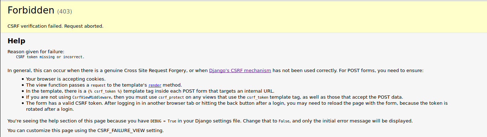
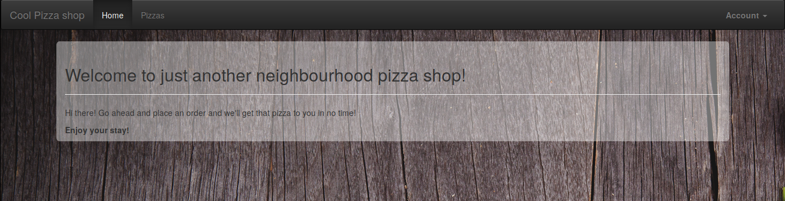
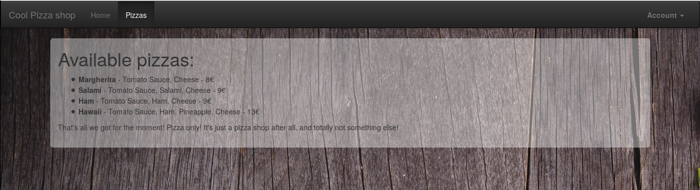
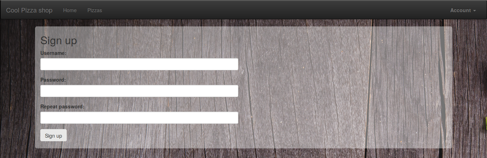
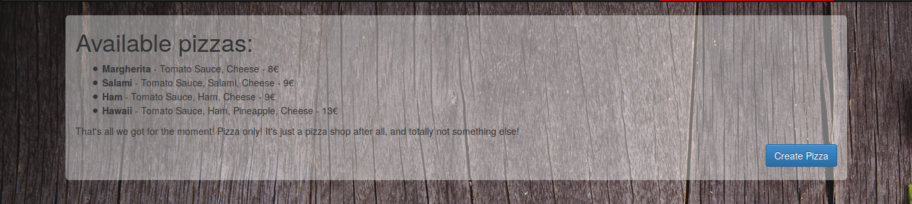
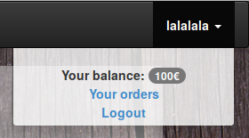

# Pizzagate

Pizzagate was the hardest Web challenge in the 34C3 Junior CTF, which Inshall'hack unfortunately solved 10 minutes after the end of the CTF. Nevertheless, it was quite interesting and therefore deserves a writeup.

## Challenge description

```
pizzagate - hard-ish

We found this [pizza shop]. It seems to be under construction currently, but we believe the whole shop is a just a front for some fishy business. Is the Italian Mafia behind all this?

Grab your OWASP Top 10 list and investigate! We need to find out what's going on!
```

## Under construction

Upon clicking on the link, we stumble upon the following page:



The source of the page contains this comment:
```html
<!-- TODO move actual index back here when development is done -->
```

… Well let's go for random tests then! Let's try to fetch `/index`.



Luckily this yields results right away in the shape of a *Django debug page*. Naturally, we to access `/admin` right away, but it just redirects to `/`. Well, that was worth a try… `/robots.txt` doesn't contain any useful information, and the same goes for `/static`. `/foobarbaz`, however, demands that we authenticate as it leads to a **devs_only** zone.



## Bypassing authentication

I immediately try to access the page using an invalid HTTP verb. This allows me to bypass the login page, but it is unfortunately insufficient as I get the following page:



Tough luck. Guess I'm going to have to actually authenticate in some way. I try a few common injections, and notice that when using `"` as the username, the **WWW-Authenticate response header** is different than usual: it goes from `WWW-Authenticate: Basic realm=devs_only err=You provided invalid credentials.` to `WWW-Authenticate: Basic realm=devs_only err=Unexpected Exception: Invalid predicate`. Seems like I broke something.

I quite assume that the server-side query looks something like `username="<username>" AND password="<password>"`. I therefore craft the following payload in the username field: `" or 1=1 or "1"="1`. Notice the second condition, that can pretty much return any valid expression; while it can be anything, it is still required as **AND** has a higher precedence than **OR** (if **AND** is **×** and **OR** is **+**, **0 + 1 * 0 = 0**, while **0 + 1 + x * 0 = 1**).

The injection works, but I am still met with a rather explicit error: `WWW-Authenticate: Basic realm=devs_only err=Your username is 'bernd' and your role is 'inactive', but 'admin' role required.`. Well, let's just fix the payload, which becomes `" or role="admin" or "1"="1`. Aaaand, I'm in!

## Within the deep site

I'm met with the following page. 



Gotta say it feels quite good to finally access some content! Let's check out all the pages I have access to:



This menu page also contains the following comment:
```html
<!--<li><b>Pizza itanimullI</b> - Annuit coeptis - Novus ordo seclorum -  1337€</li>-->
```

Might be a hint of what to buy!



Likewise, the code of this page contains an interesting non-displayed **input field**:
```html
<input type="hidden" name="role" value="user">
```

With all that in mind, let's try to sign up with an **admin** role.

```
Invalid value 'admin' for user role. Only 'user' and 'dev' supported.
```

Okay, that's straightforward. Let's create a dev account!



Now, I can create custom pizzas. Let's try to create one named **Pizza itanimullI** as described in the comment from the menu page. However, we get the following response:
```
A pizza with that name exists already!
```

The account apparently contains 100€ to spend on pizza.



After a few tries on the order page accessible from this menu, it seems like I am not able to order a **Pizza itanimullI**. I assume that this is because I do not have the required balance (*1337€*). In order to fix that, creating a pizza with a negative price springs to mind.

I create a pizza that costs **-2000€** and purchase it; I now have a balance of **2100€**!

I am now able to purchase a **Pizza itanimullI**; doing so redirects me to a new, very beautiful part of the site.

## Illuminati


The page basically contains a list of people (*illuminati!*), among which one can find **Donald Trump** or **Shia LaBeouf**, with a link to a video *proving* they're illuminati. It also contains the following hidden form:
```html
<form role="form" id="form" method="POST">
  <input type='hidden' name='csrfmiddlewaretoken' value='oNpTHcki3KZUnjo7dFXq4sdM13rAvqzCSpv78ObjnhJoVAnpCOtkPnRri68QGrXu' />
  <div class="form-group">
    <label for="illuminatiname">Name the Illuminato</label>
    <input type="text"  name="details" class="form-control">
  </div>            
  <div class="form-group">
    <label for="video">Video ID proof</label>
    <input type="text" class="form-control" id="video" name="video"/>
  </div>
  <button type="submit" class="btn btn-primary">Annult coeptis</button>
</form>
```

I try it out using the **video** parameter "*lol*" and the **details** parameter "*lel*". I check out the **POST request** and notice that it contains another parameter called **xml** that contains the following code:
```xml
<illuminato><details>lel</details><video>lol</video></illuminato>
```

Once the POST request has gone through, **a new entry containing the details/video parameters is added to the list of illuminati**. User-passed XML? **Smells like an XXE**!

After a few tries, I gather that the payload must contain both `<video>` and `<details>` tags, and come up with the following **XXE**:
```xml
<?xml version="1.0"?>
        <!DOCTYPE foo [
        <!ENTITY xxe SYSTEM "file:///etc/passwd">
    ]>
    <illuminato>
      <video>whocares</video>
      <details>%26xxe%3B</details>
    </illuminato>
```

It works, and the content of **/etc/passwd** is displayed on the page! At this point, it's just about reading the file which contains the line:
```
flagisinrootinthefileflag:x:1000:1000::/home/flagisinrootinthefileflag:
```

I modify the request to get `/flag` instead of `/etc/passwd`, and voila!

**Flag: 34C3_congratZ_you_know_owasp_and_are_in_the_illumi4nti**

-- SIben
