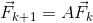

# Hello fibonacci?

"Hello fibonacci?" was a 100 point programming challenge in the AceBear
Security Contest 2018. While all in all not very complicated, I struggled a lot
to solve it due to numerous insufficient approaches. These failed approaches as
well as the one that worked will be presented below.

## Challenge description

```
Description: Yesterday, my friend shows me some math sequence. And now, it's your turn to showed me your skill. No vuln, just math, raw math :3
Service: nc 35.200.176.244 8856
```

## The problem

We connect to the service using nc and are met with the following output:

```
~$ nc 35.200.176.244 8856
Programming/ACM challenge!
Sequence: 3 2 1 4 6 7 11 17 24 35 52 76 111 163 239
Send me: number nth % N
Good luck! <3
Author: kad96
n=892905
N=380956559856027373126956504768
~$
```

The socket closes almost immediately, which means that the results will have to
be sent really fast.

It appears that we have to reply with the nth element of the sequence provided.
We connect to the service once more, in order to verify whether the sequence
stays the same.

```
~$ nc 35.200.176.244 8856
Programming/ACM challenge!
Sequence: 3 2 1 4 6 7 11 17 24 35 52 76 111 163 239
Send me: number nth % N
Good luck! <3
Author: kad96
n=714289
N=653565208569715160595426147251
~$
```

As we can see, only the values of n and N changed, so we can go ahead and
analyze the sequence.

### Analyzing the sequence

The title of the challenge is a big hint, and we quickly realize that the
sequence follows the following equation:


While we will use this sequence for our calculations, we should keep in mind
that **the server probably considers that the first member of the sequence is
3**.

## A naive solution

We'll call our function `fibo2mod` in the following implementations. Since
I am definitely not a fan of premature optimization, we implement the following
very naive solution:

```python
def fibo2mod(n, N):
    if n <= 1:
        return -1
    running = [-1, -1, 3]
    for i in range(1, n):
        running.append((running[0] + running[2]) % N)
        running = running[1:]
    return running[2]
```

The code needed to parse the input and communicate with the service is fairly
straightforward, so it won't be discussed here.

As is often the case in such challenges, solving the first problem is not
sufficient to get the flag, and the service issues other values of **n** and
**N** for which we have to provide the solution.

This naive method fails to produce a fast enough result **around the 20th
iteration**, at which point the n grows by one order of magnitude.

It seems that we have to build faster code.

## A better naive solution

Since I still believe that my solution could be sufficient given a bit of
cleaning, we implement the following function:

```python
def fibo2mod(n, N):
    a, b, c = -1, -1, 3
    for _ in range(1, n):
        a, b, c = b, c, (a + c) % N
    return c
```

This function is a bit neater, and it manages to plow through a few more
problems. Alas, there's no flag in sight yet.

Since we're obviously lazy and would really like to avoid thinking too much
(*and also to avoid having to code socket-handling code in C*), we try to
compile the previous function using `cython` and by adding furious optimization
flags to `gcc`.

Sadly, without any typing information, `cython` is not able to produce a better
result. Since the number we manipulate are so big, adding typing information
sounds like a pain. Also, many teams have solved the challenge at this point in
the CTF. Hard to believe that they would go through this trouble.

We decide to let it go and to find a smarter approach.

## Using the analytic function

An analytic function is a function that is locally given by a convergent
power series ([Wikipedia](https://en.wikipedia.org/wiki/Analytic_function)).

For example, the nth member of the Fibonacci sequence can be calculated using
the following function:


In order to find a similar functions, we must find the **eigenvectors** and
**eigenvalues** of the matrix *A* used in the following set of equations:



In our case, it's pretty easy to figure out that the system is the following:

.

We can already implement the following function in *sage*:

```python
def fibo2mod(n, N):
    n = n - 1
    return mod((u * (lambda1 ** n) + v * (lambda2 ** n) + w * (lambda3 ** n)).abs().round(), N)
```

where **lambda1**, **lambda2** and **lambda3** are the eigenvalues of the
matrices, and **u**, **v** and **w** the coefficients for which the linear
combination of the sequence correspond to the first terms of the sequence.

We execute the following lines in sage:

```sage
A = matrix([[1, 0, 1], [1, 0, 0], [0, 1, 0]])
eigen = A.eigenvectors_right()

lambda1 = eigen[0][0]
lambda2 = eigen[1][0]
lambda3 = eigen[2][0]

var('u v w')

eq1 = eigen[0][1][0][0] * u + eigen[1][1][0][0] * v + eigen[2][1][0][0] * w == 3
eq2 = eigen[0][1][0][1] * u + eigen[1][1][0][1] * v + eigen[2][1][0][1] * w == -1
eq3 = eigen[0][1][0][2] * u + eigen[1][1][0][2] * v + eigen[2][1][0][2] * w == -1

solve([eq1, eq2, eq3], u, v, w)
```

Sadly, due to a weird error from sage, the system is not solvable on my
configuration if **eq1**, **eq2** and **eq3** use the exact values provided by
`eigenvectors_right()`.

By copying approximative values for each element in the eigenvectors up to 16
decimals, I obtain consistent values for u, v, and w.

At this point, I am able to check that `fibo2mod` can and does find the exact
values of the first few members of the sequence.

Unfortunately, the members requested by the service can contain **more than
10000 digits**. The approximations used to build our function are therefore
too imprecise to provide a function that works for our use case.

### Exact analytic function

We can try to execute the previous code once again, but this time using
**symbolic representation** in order to get exact values another way. This
only requires that we replace

```python
A = matrix([[1, 0, 1], [1, 0, 0], [0, 1, 0]])
```

by

```python
A = matrix(SR, [[1, 0, 1], [1, 0, 0], [0, 1, 0]])
```

That still doesn't work, but for another reason: now, sage is unable to find
any eigenvector…

By changing our approach, it is *still* possible to find a symbolic
representation of the values we want by finding the roots **u**, **v** and
**w** of the following polynomial:


and then solving our linear system for **lambda1**, **lambda2** and
**lambda3**.

We find the roots by executing the following code:

```python
K.<X> = SR[]
P = X**3-X**2-1
P.roots()
```

With that, and after solving the system, we have a symbolic representation of
the analytic function. However, when we try to execute it… the program just
hangs.

Guess we're going to have to find another way.

## C libraries in Python

We're going to have to write in C, this time. But writing all the code to
communicate with the service sounds like a pain. Fortunately, we stumble upon
the `ctypes` library.

`ctypes` is a foreign function library in Python that allows calling functions
in shared libraries.

Using the [GNU MP Bignum Library](https://gmplib.org/) in order to handle very
large numbers, we write the following C code:
    
```C
#include <stdlib.h>
#include <stdio.h>
#include <gmp.h>

char *fibo2mod(unsigned long long n, char *mod) {
    mpz_t a, b, c, N, tmp;
    mpz_init_set_str(a, "-1", 10);
    mpz_init_set_str(b, "-1", 10);
    mpz_init_set_str(c, "3", 10);
    mpz_init_set_str(N, mod, 10);

    mpz_init(tmp);

    for (unsigned long long i = 1; i < n; ++i) {
        mpz_set(tmp, a);
        mpz_set(a, b);
        mpz_set(b, c);
        mpz_add(c, c, tmp);
        mpz_mod(c, c, N);
    }

    char *result = NULL;
    result = mpz_get_str(result, 10, c);
    return result;
}
```

and compile it to a shared object using the following compilation instructions:

```bash
~$ gcc -c -fPIC solve.c
~$ gcc solve.o -shared -o libsolve.so -lgmp
```

In order to hook it to our python code, we add the following lines there:

```python
import ctypes
import ctypes.util

solve = ctypes.cdll.LoadLibrary('/home/siben/CTF/2018/AceBear/Hello_fibonacci/C/libsolve.so')

fibo2mod = solve.fibo2mod
fibo2mod.restype = ctypes.c_char_p
```

This **DOES** provide better performance. Unfortunately, we only manage to
solve problems up to **step 40**. After asking the admins about it, I learn
that there are 100 levels to complete.

At this point, I realize I have to rethink my approach to the problem, and come
up with…

## Modular exponentiation

I don't know why I didn't think of that before. This is quite easy to
implement. We start by efficiently exponentiating the matrix we defined before,
and then multiply it with the vector containing our start elements. Using
`numpy`, we obtain the following recursive code:

```python
import numpy as np

def fibo2mod_aux(matrix, count, mod):
    if count == 0:
        return np.matrix([[1, 0, 0], [0, 1, 0], [0, 0, 1]])
    if count % 2 == 1:
        return (matrix * fibo2mod_aux(matrix, count - 1, mod)) % mod
    return (fibo2mod_aux(matrix, count / 2, mod)**2) % mod

def fibo2mod(n, N):
    mx = np.matrix([[1, 0, 1], [1, 0, 0], [0, 1, 0]])
    return (fibo2mod_aux(mx, n - 1, N) * np.matrix([[3], [-1], [-1]])) % N
```

We stare at our screen in awe while this very basic solution solves the 100
challenges without breaking a sweat.

And… we get the flag: `AceBear{Math_is_always_fun!s0me_icedoll_said!}!`

## Conclusion

I have been able to rediscover a lot of things during this challenge, so I'm
pretty happy with the result. However, the time it's taken me to actually get
the flag leaves me quite **salty**.

Folks, don't try this at home.
