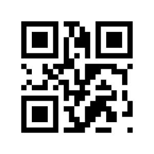
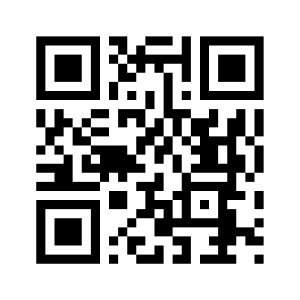
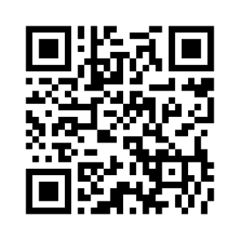
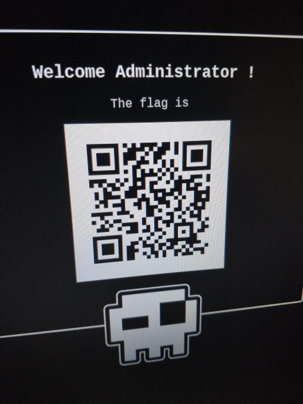

# Doors of Durin

Doors of Durin was a 200-point Misc challenge at **Nuit Du Hack 2018**. It was quite original, because the code was running on a literal **black box with a screen** on the desk of the organizers.

Since it was an original challenge, let's make an original writeup!

## Challenge description

Alas, the doors have shut on their secrets. Heed my words, those of the one who remembers.

## Legends of the darkness

Through the cold of the night, we arrived at the tavern. We knocked, and knocked, and knocked again, but the doors remained locked. As we were about to lose hope, a square eye appeared and words formed on the glass-like surface of the doors: **“Speak, friend, and enter”**.

“That's impossible,” Lfuret muttered, an incredulous look on his face. “This door should not exist.”

“Pray tell,” I said. “What do you know?”

“I have read of this door in the old books. The legends say the people of the **QR Cøde** once built it to protect their fortress. Alas, the QR Cøde civilization disappeared when the world felt it had no use for them anymore. This door should have had the same fate.”

“Yet, here it stands.” I remarked.

“Here it stands.” he acquiesced.

## The QR Cøde speech

I rummaged through the bag I had stolen from Gøøgle the old sorcerer the night before, hoping his scroll of knowledge would provide us with the right words to say and a way to communicate them to the old QR Cøde door.

“Gøøgle knew his way around the land. It says [here](http://lotr.wikia.com/wiki/Doors_of_Durin) that **mellon** is the right answer.” I said, pointing at the scroll “It's an old elvish riddle designed to fend off their stupidest enemies.”

Lfuret groaned. “Elves… Then we definitely need to open these doors, and slay these filthy creatures.”

“Agreed,” I said “and apparently we also stole the old [QR Cøde speech translator](https://www.unitag.io/fr/qrcode) from Gøøgle's laboratory”

I played around with the settings of the translator.

“And here are the runes we need!”

As soon as the eye took notice of the runes in front of it, a mechanism started turning within the door and the words on its surface changed.

“Welcome **YuckyNoPrivilegeFriend**,” Lfuret deciphered painfully, “What does that mean?”

The mechanism had stopped turning.

“I'm not sure, I said,” shaking the door violently “but it's still locked…”

“I have an idea” he said, stealing the translator from my tired hands.

## A call to the Gods

“I call to you, old pagan Gods. Please bestow upon us the ancient power of **SQL injections**, so that we may crush your elvish enemies!”

A writing appeared on the floor: **mellon" or 1 == 1 --**, and the runes got blurrier and blurrier, until…

The door now read "Welcome **Smeagol, you unprivileged prick**". The mechanism turned once again within the doors. I tried to open them again, but they were still locked.

“Well, that did something,” I started “Let me try my luck at this.”

“I invoke you, **offset** and **limit**, **protectors of the SIben family**, my spirit animals. Please use some of my life energy to fix this payload!”

The writing on the floor started to change, empowered by the life force my protectors drained from me, becoming **mellon" or 1 == 1 limit 1 offset 1 --**. Once again, the runes changed as well.

This time, the words "Welcome **Admin**" appeared on the door, and the doors opened themselves.

## Resting for the night

The tavern was empty, and the beer was stale. We found a scroll on the floor.

Since we were not going to slay any elf that night, we took turns sleeping on the bar, and logged our adventure in the travel book.

God, we were thirsty.