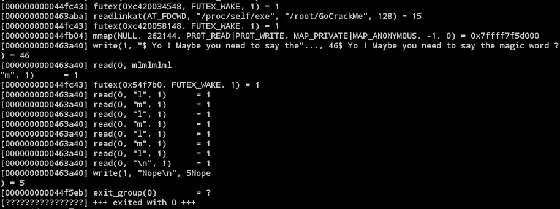

# GoCrackMe

GoCrackMe was a 400-point challenge at **Nuit Du Hack 2018** on which we got first blood quite early in the CTF.

## Challenge description

Because we can't access the platform anymore, this challenge shall remain without description for now.

## Write-up

As the name of the challenge implies, this binary is a **Go executable**.
After a quick static analysis, we found out that the whole binary is stripped, which makes pursuing such an analysis pretty difficult (*since we also have to consider all the indirections used by the language itself*).

Using strace, we drew a rough sketch of how the binary works:

```
(print message) -> (read user input) -> (check input) -> (print fail/win)
```



Since the **codebase is huge** (*thanks Go*), we needed to find a way to **pinpoint the exact functions processing our input**.

We first tried to **break on the read syscall loading our flag in memory** so as to then check where this would take us.
Unfortunately, because of the code abstraction in Go, we were prevented from discovering anything interesting (*as we quickly got lost in the numerous calls to other functions*).

Our second idea was to **break on the second write syscall** (*writing the fail/win message*) and then **go up the call stack until we hit the flag verification function**; this turned out to be the right idea, but not in the way we expected.

Observing the parameters in gdb led us to see that **rsi** (*buffer address*) pointed to the failure string after the syscall; however, this string was **not null-terminated** and **followed by a weird ascii string that we couldn't find anywhere in the executable itself**.


To gather more information, we looked up the section containing the string and dumped it. Running our favorite command `strings` on it, we discovered a lot of different strings as well as **fake flags**.


After trying a few of them, we were surprised to discover that this dump **actually contained the flag**.


**Challenge password: This1sATotalLyDumbPa5$wordBut1tW0rkN3h**

**Challenge flag: ndh16_2c51459d50d04a8705493d2ab9696e21f17ddd62ebbe106dbbca8a18a867c82f9ea1c84319035b95cbc64303dbf26172c67adac64a45f48854c272cbc2608957**

# Wrapping up

We already knew `strings` was awesome, and running it on random binary blobs sure can yield unexpected results!
