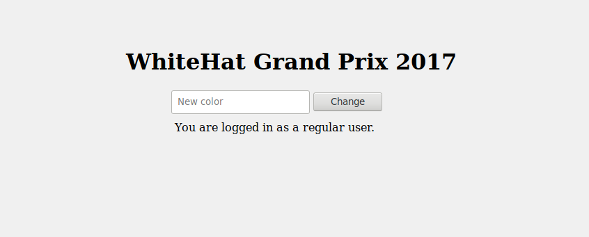
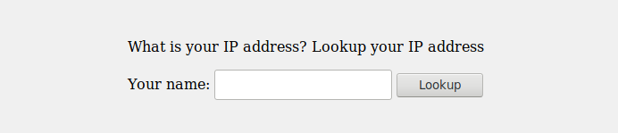
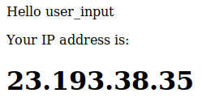

# Ssi

Ssi was a 100 point Web challenge in the WhiteHat Grand Prix 2017, solved by **Shrewk** and myself (**SIben**). As the amount of points suggests, it was one of the easiest challenges of the CTF (points were usually from 100 to 500). Nevertheless, it took us quite a while to completely solve it.

## Challenge description

```
Ssi

Link: ssi.grandprix.whitehatvn.com
Backup: bak.ssi.grandprix.whitehatvn.com

Author - BkavTeam
```

## Color changes

Upon clicking either of the links, we stumble upon the following page:



When inputting a color like *xxx*, the following code is produced:

```html
<h1 style="color:xxx;">WhiteHat Grand Prix 2017</h1>
```

Now, it's not quite clear how this is interesting in the context of a CTF. We quickly figure out that there must be some more information we can gather about the nature of the task.

### Backup file

We find that the file **index.php~** exists and contains the following PHP code:

```php
<?php 
	session_start();
	if(isset($_POST['textColor'])){
		foreach($_REQUEST as $key => $val) { 
	    	$_SESSION[$key] = $val; 
		}
	}
	if(array_key_exists("textColor", $_SESSION)){
		$style ="color:".$_SESSION['textColor'].";";
	}
	// 
	if(array_key_exists('secret', $_SESSION) and array_key_exists('textColor', $_SESSION)){
		sleep(1);
		$temp = $_SESSION['secret'].$_SESSION['textColor'];
		if(substr(sha1($temp),-3) ==='ab1'){
			//Do sth admin permission
		}
		else{
			$status ="You are logged in as a regular user.";
		}
		
	}
	else{
		$status ="You are logged in as a regular user.";
	}
	
	$title = "<h1 style='$style'>WhiteHat Grand Prix 2017</h1>"; 
?>
```

So basically, we need to provide a **POST parameter** named *secret* which, once concatenated with *textColor* must generate a **SHA-1 hash** ending with the characters "*ab1*".

This should occur for about **1 hash out of 4096** (*16×16×16*). Therefore, we use the following code to generate a value:

```python
from hashlib import sha1

for val in range(5000):
    if sha1(str(val)).hexdigest()[-3:] == 'ab1':
        print val
        break
```

This outputs the string "**1868**".

We make a POST request to the server with *secret=18&textColor=68*, and we get redirected to http://ssi.grandprix.whitehatvn.com/showip.php.

## Show IP



If we look at the console, we get the following information:

```
Debug Objects: Flag at directory: value_special/flag.txt
showip.php:1:1
Debug Objects: value_special = md5(filesize(index.php)-namechannelIRC)
showip.php:1:1
```

Okay, so now we know what we need to find in order to get the flag. **namechannelIRC** is quite obviously **#whitehatgrandprix2017**, the channel dedicated to the CTF on *Freenode* and provided within the guidelines of the CTF.

### Trying out the input

We input the string "*user_input*" and press the button. We're redirected to the page http://ssi.grandprix.whitehatvn.com/result.shtml which has the following content:



*user_input* is displayed on the page, and the file extension of the page is **shtml**. Well, the title of the challenge was **Ssi**, wasn't it?

Since we need to find the size of **index.php**, we input the following payload instead of *user_input*:

```html
<!--#fsize file="index.php"-->
```

This works directly and outputs **1.6K** on the result page. Now, this is the part where we messed up; we didn't really understand what the **-** character in **md5(filesize(index.php)-namechannelIRC)** was supposed to be. Substracting strings didn't really make sense. We figured that we should get the *filesize* in bytes, which we had no success with. After a few hours of derping, I sent a PM to an admin asking them for clarification regarding this format.

The following line was added to the previous log:

```
Debug Objects: - is a character
showip.php:1:1
```

At this point, we felt pretty stupid and tried the following command:
```bash
$ echo -n "1.6K-#whitehatgrandprix2017" | md5sum
36789f5cc2688fb98476eea77c6696fe  -
```

Lo and behold, the file http://ssi.grandprix.whitehatvn.com/36789f5cc2688fb98476eea77c6696fe/flag.txt actually exists and contains the string `Learn_form_yesterday.Live_for_today.Hope_for_tomorrow.`.

Following the guidelines of the CTF, we hash this string using **SHA-1** and get the flag: **WhiteHat{dffb112c136d8317033a2152b8d32a3125cd4e4c}**.
